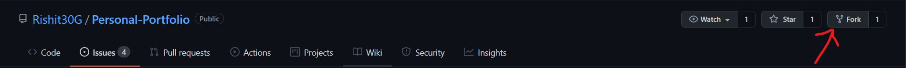
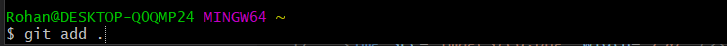
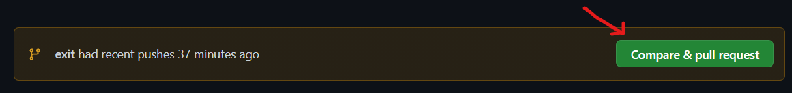
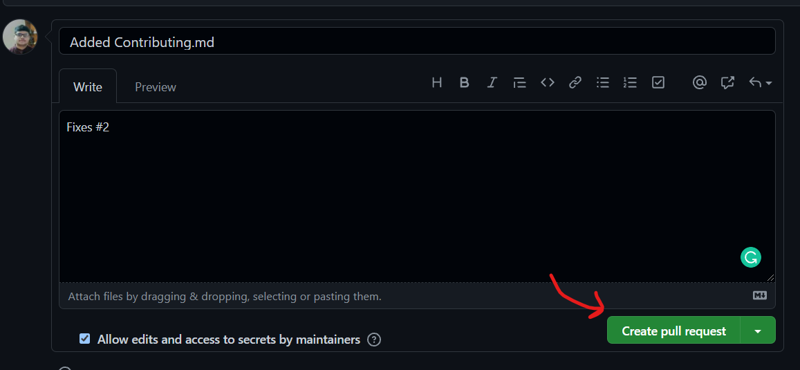

# Contributing Guidelines

### Learn how to Fork a repo , make changes and ask a maintainer to review and merge

## Creating a Pull Request
If you want to contribute to other projects on Github. How do you do it? 
When you want to work on another's GitHub project, the first step is to fork a repo. 
 

This creates a new copy of the repo under your Github user account.
- Clone this Github repo. Open up the GitBash/Command Line and type in: 
 

- cd into the specific directory. 
- Now create a branch of the master by pushing the command: 
git branch <YOUR_USERNAME > 
 
 

- Start Coding. Make apt commits with proper commit messages. Always use git status to see that you have not made changes on the file you were supposed not to 

- Add all the changes with this command: (git add .). This will add the changes to your present workspace. 
 

- Make a commit. This will save a snapshot of your Project. 
 

- Push the changes : git push 
 

- Once you push the changes to your repo, Go to your forked repository 
 

- Click it and you'll be taken to this screen. 
 

- Open a pull request by clicking the Create pull request button. This allows the repo's maintainers to reviews your work. From here, they can merge it if it is good, or they may ask you for some changes.

